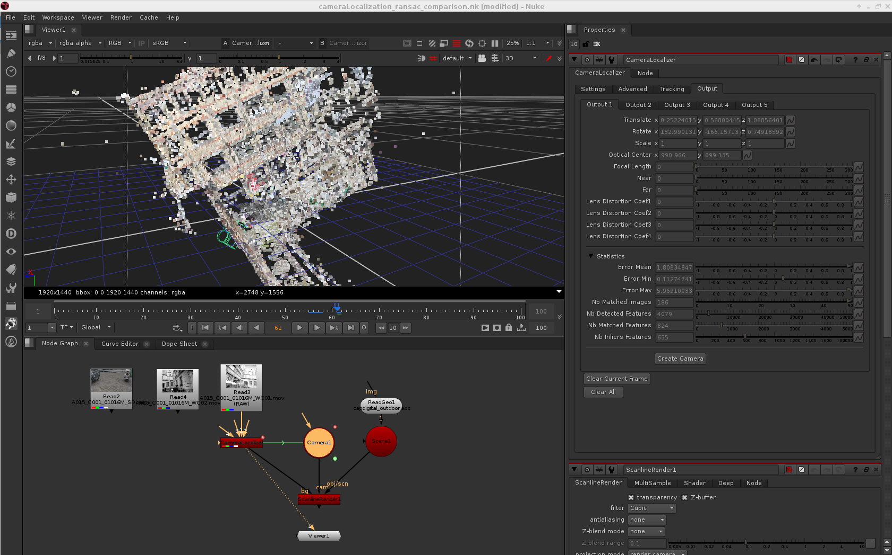

ofxMVG
======

[OpenFX](http://openeffects.org) plugins for Multiple View Geometry

Follow developments: 
[](http://waffle.io/poparteu/ofxMVG)
[](http://waffle.io/poparteu/ofxMVG)

## CameraLocalizer

CameraLocalizer estimates the camera pose of an image regarding an existing 3D reconstruction generated by openMVG.
The plugin supports multiple clips in input to localize a RIG of cameras (multiple cameras rigidly fixed).



[CameraLocalizer on ShuttleOFX.](http://shuttleofx.org/plugin/openmvg.cameralocalizer)

## LensCalibration

LensCalibration estimates the best distortion parameters according to the couple camera/optics of a dataset.
The plugin supports video file & folder containing images or image sequence.

[LensCalibration on ShuttleOFX.](http://shuttleofx.org/plugin/openmvg.lenscalibration)

## Compilation

```
git submodule update -i
mkdir build
cd build
cmake .. -DCMAKE_INSTALL_PREFIX=../install
make install
```

## Usage
```
export OFX_PLUGIN_PATH=/path/to/ofxMVG/install
```
Then launch your preferred [OpenFX](http://openeffects.org) Host.
Currently, the plugins have only been tested in Nuke.

## License

The plugins are released under the [MPL License](LICENSE.md).
